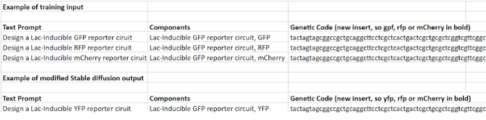

<h1 align="center">
SBOL-Diffusion - Text-Prompt Guided Stable Diffusion for Genetic Circuit Design in SBOL 🧬
</h1>

Use natural language to create a fully functional genetic circuits!

    

## 📚 Table of Contents

1. [🧬 Vision & Impact](#Vision)
2. [🌐 Abstract](#Abstract)
3. [⚙️ Introduction](#Introduction)
4. [🏠 Stable diffusion for Genetic Circuit Design](#Design)
5. [🔧 Synthetic Biology Open Language Ontologies](#Ontologies)
6. [🛠️ Data availability of genetic circuits](#circuits)
7. [⚙️ Data Preparation](#Preparation)
8. [📊 Reward functions](#functions)
9. [✏️ Text Prompts for Guiding the Design Process](#text)
10. [🦠 Proof of concept](#concept)
11. [💻 Validating genetic circuits designed with stable diffusion](#stable)
12. [🔄 Applications of SD for genetic circuit design](#Applications)

## 🧬 Vision & Impact

What if you can create genetic circuits that exhibit certain phenotypes and fulfill certain functions by only using natural language?

Prompts of a kind: "Design a genetic circuit that acts as a biosensor to detect the presence of a specific molecule and produce a fluorescent output."
Could be used to design genetic circuits in a standardized, machine readable way. This would allow non-biologists to create genetic circuits, the same way midjourney allowed anybody to create images.

## 🌐 Abstract

In this research, we aim to develop a novel approach to generate genetic circuits with specific properties by employing conditional stable diffusion on ontologies of Synthetic Biology Open Language (SBOL), guided by text prompts. We posit that this methodology will result in fully correct genetic circuits that satisfy certain biological constraints while providing an intuitive and human-readable interface for the design process. Additionally we assume that conditioning the generation on certain reward functions might further enhance the generative process.

## ⚙️ Introduction

Synthetic biology is an interdisciplinary field that seeks to engineer biological systems with novel functionalities (Cameron, Bashor, & Collins, 2014, "A brief history of synthetic biology"). A genetic circuit is an engineered, synthetic biological system designed to perform specific functions within a living cell or a cell-free environment. Genetic circuits are inspired by electronic circuits, where components are connected in specific ways to process signals and produce desired outputs. They play a pivotal role in the development of innovative synthetic biological systems (Nielsen & Voigt, 2014, "Multi-input CRISPR/Cas genetic circuits that interface host regulatory networks"). As the complexity of genetic circuit design increases, advanced computational methods are required to optimize their performance.

## 🏠 Stable diffusion for Genetic Circuit Design

Stable diffusion saw vast applications since its text-to-image inception in 2022. Since then, the applications to protein (RFDiffusion), DNA (DNA Diffusion) and generally any output format (image, tabular, text) has seen big growth. Stable diffusion can be employed to guide the design of genetic circuits by exploring the vast search space of possible designs while optimizing for specific properties and satisfying biological constraints. Given that the SBOL ontologies are available in public repositories, and can be further gathered, employing stable diffusion to guide the design of genetic circuits seems like a valuable proposition. Researchers can effectively explore the complex design space and identify optimal solutions that meet their desired properties and constraints. This approach can lead to more efficient and effective genetic circuit designs for various applications in synthetic biology and related fields.

## 🔧 Synthetic Biology Open Language Ontologies

SBOL is a standardized language for representing genetic design information (Galdzicki et al., 2014, "The Synthetic Biology Open Language (SBOL) provides a community standard for communicating designs in synthetic biology"). Ontologies in SBOL provide a structured and formalized representation of biological knowledge, which facilitates automated reasoning and decision-making in genetic circuit design (Mısırlı et al., 2014, "A framework for the collaborative design of synthetic biological systems"). By incorporating stable diffusion algorithms with SBOL ontologies and text prompts, we can leverage the rich biological knowledge encoded within these ontologies to guide the design process and produce valid genetic circuits.

## 🛠️ Data availability of genetic circuits

Based on the data that's currently available (i.e. very limited) only reasonable approach seems to conduct this approach initially only in E.Coli. The benefit of this approach is that proof-of concept can be achieved and validated relatively fast.
1. iGEM Registry of Standard Biological Parts (http://parts.igem.org/): The iGEM Registry is a repository of genetic parts, devices, and systems used in synthetic biology. It contains thousands of BioBrick parts and other genetic components, which can be accessed and downloaded in SBOL format.

2. SynBioHub (https://synbiohub.org/): SynBioHub is a web-based repository for synthetic biology designs, providing a central location for storing, sharing, and accessing genetic circuit data. It supports SBOL format and can be used to search, browse, and download genetic circuit designs for training RL agents.

3. JBEI-ICE (https://public-registry.jbei.org/): The Joint BioEnergy Institute Inventory of Composable Elements (JBEI-ICE) is a registry for biological parts and associated information. It supports SBOL format and provides data on various genetic parts, such as promoters, terminators, and coding sequences.

4. CIDAR MoClo Parts Kit (http://www.cidarlab.org/moclo/): The CIDAR MoClo Parts Kit is a collection of standardized genetic parts designed for use with the modular cloning (MoClo) assembly method. The parts are available in SBOL format and can be used for constructing and simulating genetic circuits.

In addition to the resources previously mentioned, following databases can be used to scrape additional adjacent data:

4. Addgene (https://www.addgene.org/): Addgene is a nonprofit plasmid repository that stores and distributes plasmids, which are circular DNA molecules used as cloning vectors in genetic engineering. Researchers can search and request plasmids, many of which contain genetic circuit components. Although Addgene does not provide data in SBOL format directly, you can manually extract genetic circuit information from the plasmid sequences and annotations.

4. NCBI Nucleotide (https://www.ncbi.nlm.nih.gov/nucleotide/): The NCBI Nucleotide database is a comprehensive collection of DNA and RNA sequences from various sources, including genomes, genes, and genetic parts. You can search for genetic components and circuits using keywords or sequence identifiers. While the database does not provide data in SBOL format, you can extract genetic circuit information from the GenBank or FASTA files and convert them into SBOL format using appropriate tools or libraries.

4. Virtual Parts Repository (ViPR) (https://www.vipr.bio.ed.ac.uk/): ViPR is a database of standardized genetic parts, devices, and systems that have been computationally designed using the GenoCAD platform. The repository contains a collection of genetic parts, which can be used as building blocks for designing genetic circuits.

4. The SEVA Database (https://seva.cnb.csic.es/): The Standard European Vector Architecture (SEVA) database is a resource for standardized vectors and genetic parts used in bacterial strain engineering. The database provides a collection of plasmids, origins of replication, antibiotic resistance markers, and other functional elements, which can be used as building blocks for constructing genetic circuits.

4. EcoCyc (https://ecocyc.org/): EcoCyc is a comprehensive database of Escherichia coli biology that includes information on the E. coli genome, genes, proteins, and metabolic pathways. Although EcoCyc primarily focuses on E. coli, it can provide useful information on the native genetic components and regulatory elements that could be repurposed for designing genetic circuits in other organisms.

4. Plasmid.io (https://plasmid.io/): Plasmid.io is a web-based platform for designing, simulating, and sharing plasmids and genetic circuits. It provides a collection of genetic parts and tools for constructing and simulating genetic circuits, which can be potentially used for training reinforcement learning agents.
Further work needs to be done to really reconcile and synchronize all of the data. Main starting points are iGEM registry and SynBioHub.

## ⚙️ Data Preparation

Here is the biggest obstacle: data is not available to a big extent.
In order to apply stable diffusion first we need to properly prepare the data. In short following should be one entry of one genetic circuit.

Genetic circuit components: genes, proteins, promoters etc.
Relationship between these components such as the order in which they appear in the genetic circuit or their interactions.
Text prompts that describe the desired characteristics of the genetic circuit, such as the function, target organism, or specific components to include or exclude.

To convert the collected SBOL data into a standardized and compatible format for the Stable Diffusion model, we will follow following steps.

1. Parse SBOL Data:
Using an SBOL library, such as pySBOL or libSBOL, to parse the SBOL data files and extract information about genetic circuit components (promoters, terminators, genes, etc.) and their relationships.

1. Encode Genetic Circuit Components:
For each genetic circuit component, assign a unique identifier (e.g., an integer or a one-hot encoded vector) to represent its type (promoter, terminator, gene, etc.).
Encode the properties of each component, such as strength, sequence, or other relevant characteristics, as a vector or another suitable data structure. This could involve using continuous values (e.g., real numbers for promoter strength) or discrete representations (e.g., one-hot encoded vectors for DNA sequences).

1. Encode Component Relationships:
Represent the relationships between components, such as the order in which they appear in the genetic circuit or their interactions, using adjacency matrices, edge lists, or other suitable data structures that can capture these connections.

1. Construct Input Data:
Combine the encoded component information and relationships into a single data structure, such as a graph, matrix, or tensor, depending on the requirements of the Stable Diffusion model. Ensure that this data structure can represent the entire genetic circuit, including its components and their interactions.

1. Standardize Data:
If necessary, standardize the data by scaling or normalizing the feature values to ensure they have comparable magnitudes. This can help improve the learning process and the performance of the Stable Diffusion model.

## Reward functions 

Incorporating a reward function as part of a conditional diffusion process:

Conditional diffusion models are an extension of diffusion models, where the generation process is conditioned on specific input variables or conditions. By conditioning the generative process on additional information, we can guide the generation of samples with specific properties or characteristics.
To include a reward function in a conditional diffusion process, we will:
Define a reward function that quantifies the desired properties or constraints of the generated samples. This reward function should be designed such that higher rewards correspond to better samples with respect to the desired objectives.
Calculate the rewards for the training data and use these rewards as additional input conditions for the conditional diffusion model. By conditioning the generative process on the rewards, the model learns to generate samples that not only resemble the training data but also exhibit the desired properties or constraints as quantified by the reward function.
During the generation process, you can provide a target reward value as an input condition to guide the generation of samples with specific properties or constraints.
By incorporating reward functions into a conditional diffusion process, you can effectively guide the generation of samples with specific properties or constraints based on the defined reward function.

Reward functions:
Functionality reward: Evaluate the extent to which the generated genetic circuit performs its intended function, such as logic gates, oscillators, or other biological processes (Elowitz & Leibler, 2000, "A synthetic oscillatory network of transcriptional regulators").
Robustness reward: Assess the resilience of the genetic circuit against environmental fluctuations or internal noise, ensuring that the circuit maintains its functionality under varying conditions (Kitney & Freemont, 2012, "Synthetic biology - the state of play").
Modularity reward: Encourage the design of modular genetic circuits that can be easily combined with other circuits or reused in different contexts, promoting reusability and extensibility (Endy, 2005, "Foundations for engineering biology").
Efficiency reward: Optimize the genetic circuit for efficient resource utilization, such as minimizing energy consumption or metabolic burden on the host organism (Shachrai et al., 2010, "Cost of unneeded proteins in E. coli is reduced after several generations in exponential growth").
Scalability reward: Reward genetic circuits that are scalable and capable of maintaining their functionality when integrated into larger, more complex systems (Nielsen & Voigt, 2014, "Multi-input CRISPR/Cas genetic circuits that interface host regulatory networks").
Safety reward: Evaluate the safety of the genetic circuit by penalizing designs that could pose risks, such as the production of toxic substances or off-target effects (Brenner et al., 2008, "T7 RNA polymerase-driven inducible cell lysis for DNA transfer from Escherichia coli to Bacillus subtilis").
Speed reward: Optimize the genetic circuit for fast response times, ensuring rapid activation or deactivation in response to stimuli (Canton et al., 2008, "Refinement and standardization of synthetic biological parts and devices").
Evolvability reward: Encourage genetic circuits that are amenable to further optimization or evolution, allowing for continuous improvement and adaptation to changing requirements (Wagner, 2008, "Robustness and evolvability: a paradox resolved").

## ✏️ Text Prompts for Guiding the Design Process

Similar to what was done in the DNA Diffusion project, one can design DNA with specific enhancer regions that would exhibit the desired phenotype. Examples of stable diffusion guided DNA generation:

"A sequence that will correspond to open (or closed) chromatin in cell type X"

"A sequence that will activate a gene to its maximum expression level in cell type X"

"A sequence active in cell type X that contains binding site(s) for the transcription factor Y"

"A sequence that activates a gene in liver and heart, but not in brain"

In similar fashion we envision that following prompts might be interesting for the design of genetic circuits:

"Design a genetic circuit that acts as a biosensor to detect the presence of a specific molecule and produce a fluorescent output."

"Optimize a genetic circuit for the production of biofuel in E. coli under anaerobic conditions."

"Create a genetic circuit that functions as a toggle switch, allowing the switching between two stable states in response to an external stimulus."

"Develop a genetic oscillator circuit with a tunable frequency and amplitude."

"Design a genetic circuit that can degrade an environmental pollutant with high efficiency and minimal side effects on the host organism."

These text prompts provide high-level descriptions of the desired properties, functionality, or constraints of the genetic circuits. This allows more creativity from the stable diffusion model. More specific text prompts are also viable.

## 🦠 Proof of concept

Proof of concept of the data and the 3 necessary columns to actually execute diffusion model can be found underneath:

## 💻 Validating genetic circuits designed with stable diffusion

Involves a combination of computational simulations, in vitro experiments, and, when applicable, in vivo testing. Here are some key steps for validating stable diffusion-generated genetic circuits:

1. In silico validation: Perform computational simulations to predict the behavior of the designed genetic circuits. Tools such as the COBRA Toolbox (Heirendt et al., 2019, "Creation and analysis of biochemical constraint-based models: the COBRA Toolbox v3.0") and Tellurium (Medley et al., 2018, "Tellurium: An extensible python-based modeling environment for systems and synthetic biology") can be used to simulate circuit dynamics and verify their functionality in a controlled virtual environment.

2. In vitro validation: Construct the designed genetic circuits using standard molecular cloning techniques, and then test their functionality in vitro using cell-free systems or cell lines. Techniques such as the TX-TL system (Karzbrun et al., 2014, "Programmable on-chip DNA compartments as artificial cells") can be employed to assess circuit behavior in a cell-free environment.

3. Quantitative measurements: Use quantitative techniques, such as quantitative PCR (qPCR), flow cytometry, and fluorescence or luminescence measurements, to characterize the performance of the genetic circuits in terms of gene expression levels, response times, and other relevant metrics.

4. In vivo validation: When applicable, test the designed genetic circuits in living organisms, such as model organisms (e.g., bacteria, yeast, or mammalian cells). This step is crucial for evaluating the circuit's performance under real-life conditions and assessing its impact on the host organism.

5. Reiterate and optimize: Analyze the results from the in silico, in vitro, and in vivo validations to identify potential improvements in the genetic circuit design. Use this feedback to refine the reinforcement learning model and generate new, optimized designs for further validation.

6. Benchmarking: Compare the performance of the RL-generated genetic circuits with existing designs or experimental data from the literature to evaluate their relative effectiveness and efficiency.

## 🔄 Applications of SD for genetic circuit design

1. Gene therapy optimization: SD can be used to optimize genetic circuits for targeted gene therapies, improving their efficacy, safety, and specificity in treating genetic disorders or diseases.

1. Biosensor design: SD can aid in the development of more sensitive and specific biosensors by optimizing genetic circuits to detect particular molecules or environmental conditions.

1. Metabolic pathway engineering: SD can be applied to optimize genetic circuits that control metabolic pathways in microorganisms, enhancing the production of biofuels, pharmaceuticals, or other valuable chemicals.

1. Adaptive biocomputing: SD can be employed to design genetic circuits that adapt their computational behavior in response to changing conditions or inputs, enabling the development of more versatile and robust biocomputers.

1. Dynamic gene expression control: SD can be used to design genetic circuits that regulate gene expression in a more precise and controlled manner, potentially leading to more effective gene therapies or cellular reprogramming.

1. Synthetic biology in agriculture: SD can optimize genetic circuits for enhancing crop productivity, stress tolerance, or nutrient uptake in plants, promoting more sustainable agricultural practices.

1. Environmental bioremediation: SD can be employed to design genetic circuits that enable microorganisms to degrade pollutants or toxins in the environment, contributing to more effective bioremediation strategies.

1. Drug discovery and development: SD can be used to optimize genetic circuits for high-throughput screening or drug production, accelerating the drug discovery and development process.
